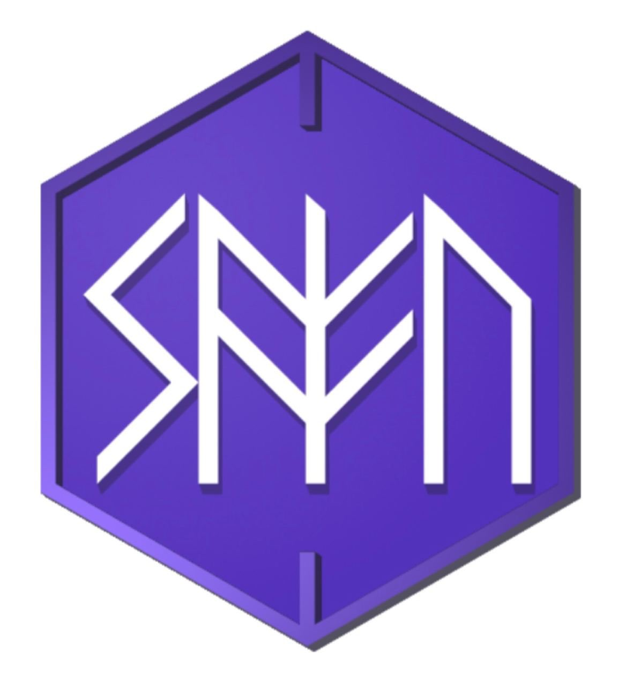

&nbsp;

<h1 align="center">백서 2.0</h1>

강형석

<h4 align="center">2022년 11월

 

# 초록(Abstract)

2022년부터 테라와 거래소들이 망하는 과정에 대해 탐구하고 SEC와 검찰에 수사를 참고인으로서 도운 결과, 현재 우리가 아는 암호화폐 생태계는 스스로에 대한 정의를 내리지 못하고 애매한 탈중앙화를 표방한 채 개인의 자산에 대한 주권을 무시하고 탈취해가는 아수라장으로 변질되었다. 탈중앙화된 돈은 탈중앙화된 경제를 위에서 만들어진다는 전제 하에 스탠다드 프로토콜은 개인의 디지털 자산을 보호하며 더 안전하며 지속가능한 탈중앙화 경제를 만드는 프로토콜 버전 2에 대한 백서를 공개한다. 

# 서론(Introduction)

현재 스탠다드는 더 나은 블록체인 기술을 만든 전투에는 이겼다고 생각할 수 있으나 기술을 대중에 도입시키기 위한 전쟁에서는 패전하였다. 스탠다드는 테라가 처음부터 지속가능하지 않을 것과 개인의 디지털 자산 및 사생활을 침해하고 있다고 생각하여 이에 대항하기 위해 만들어졌다. 이후 지난 1년동안 세가지 기술적인 성과를 거둘 수 있었다.

첫째, 탈중앙화 경제를 만들 때 개인의 자산을 보호하기 위한 안전장치를 제공하는 스마트 컨트랙트 패턴 표준 EIP5252를 draft로 등록했다. 둘째, 로드맵에서 제시한 오라클 런타임 모듈의 완성본을 제외한 나머지 로드맵 관련 기술들을 모두 개발해냈다. 셋째, 과담보 스테이블 코인을 만드는 과정에서 CDP 데이터를 한 컨트랙트에 linked list로 저장하는 메이커 다오와는 달리 clone factory 패턴을 이용하여 가스 비용을 메이커다오보다 일정하고 더 낮고 aave와 같은 operation cost가 나오게 할 수 있었다.

스테이블 코인 기술이 이제 만들어지고 다른 탈중앙화 금융 생태계에 스테이블 코인을 도입하는 전쟁에 참여하기 위해 기존 탈중앙화 금융의 동태를 살펴 봤으며 현재 탈중앙화 금융은 defi2.0가 자리잡고 있었다. 그러나 현재 Defi 2.0에는 여러가지 문제점들이 있었다.

디파이 2.0는 주로 개인이 예치한 토큰에 대해 주는 이자율을 가지고 경쟁하며, 전문적인 "알고리듬"이나 "개인 혹은 단체"에 자금을 맡기는 형태를 보인다. Fei Protocol은 Protocol Owned Liquidity(POL)[1]()을 제시하여 함께 모인 자산들로 탈중앙화 대출 서비스에 유동성을 제공하여 더 많은 수익을 얻을 수 있다는 명의로 자산 유동성을 모았으며 Olympus DAO[2]()는 자신의 탈중앙화된 자율조직의 거버넌스 토큰을 담보 없이 매우 높은 이자로 갚는다는 빌미로 기존 유니스왑이나 스시스왑의 LP 토큰을 빌려오는 bond를 발행해 개인들의 자산을 끌어모았다.

그러나 이들은 하나같이 경제적 독립보다는 이익을, 진실과 검증에 기반한 신뢰보다는 무조건 추종을 택하여 문제들에 직면하게 되는데 Fei protocol의 경우 Rari capital이라는 Compound의 포크에 무턱대고 돈을 빌려줬다고 해킹으로 그렇게 개인한테서 모은 자산들에서 80M 미국 달라라는 막대한 손해[3]()를 입게 되었다. Olympus DAO의 경우 자체 거버넌스 토큰의 가치에 대한 담보가 없었으며 거버넌스 토큰에 대한 확실한 기능이 발표되기 전에 내부 관계자의 과도한 매도를 시작으로 가장 늦게 매도한 사람이 가장 큰 손해를 입게되는 폰지사기 구조[4]()를 띄게 되었다. 이들의 공통점은 모두 사용자의 예치금에서 손해를 입혔다는 것이며 FTX와 같은 일이 일어났다고 해도 과언이 아닐 것이다. 따라서 스탠다드는 사용자의 예치금을 최우선으로 보호하며 사용자가 예치한 모든 자금을 투명하게 공개하고 사용자가 더 자유롭게 예치금을 사용할 수 있도록 하여 기존의 탈중앙화 금융을 뒤엎는 디파이 3.0을 제시한다.

# Standard 2.0

스탠다드 2는 1과 같은 초록에 명시된 사명을 가지고 구현된다. 다른 점이 있다면 토크노믹스, 탈중앙화 거래소, 스테이블 코인이 새롭게 바뀌었다. **토크노믹스**는 지속가능한 수요를 부여하여 토큰의 가치가 좀더 안정적으로 유지되게 하는 멤버십 토큰으로서 바뀐다. 탈중앙화 거래소는 1에서의 유니스왑 포크에서 벗어나 Safe CEX인 **신질서**(New Order)를 출시한다. USM은 1에서의 페깅 알고리듬에서 발전하여 **SAFU**라는 스테이블코인으로 바꾼다.

# 1. 정의 (Justice)

현재 암호화폐 프로젝트 토큰의 토크노믹스는 "정의는 강자에게 유익하다는 것"을 표방하고 있다. 하나의 암호화폐 프로젝트를 개발한다고 했을 때 생기는 거버넌스 및 네트워크 토큰은 투자를 받을 때 벤쳐 캐피탈과 개발 팀원들에게 먼저 배정된다. 팀원은 그 토큰을 마음대로 발행할 수 있다. 거버넌스를 만들어도 토큰이 많은 사람이 모든 안건을 결정한다. 그렇다면 정의는 강자에게 유익하게 하기 위해 생긴게 맞을까? 

정의가 강자에게 유익한 것이라는 궤변은 플라톤의 '국가' 1권에는 국가를 이루는 정의에 대해 트라시마코스와 소크라테스가 토론하면서 모순을 드러낸다. 이상적인 국가는 정의를 가진다는 대전제 하에 트라시마코스는 '강자에게 유익한 것'이 진정한 세상의 정의라고 말한다. 예를 들어 강자로 해석되는 지배자들은 자신들에게 유리한 법과 제도를 만들고 약자들에게 이를 따르는 것이 정의라고 말하며 이를 통해 세상은 강자가 원하는 대로 이끌려갈 수 밖에 없다는 것이 바로 트라시마코스의 주장이다. 이에 일반적으로 불의라고 일컬어지는 지배자들의 탐욕과 비리는 이치에 따른 진정한 정의라고 할 수 있는 것이고 반대로 선량하게 살아가는 사람들은 진정한 정의를 깨닫지 못한 채 강자들에게 이용당하는 불행한 삶을 산다는 것이다.

트라시마코스의 주장을 듣고 소크라테스가 다음과 같이 반박하였다. "지배자들이 자신에게 유리한 결정을 하는 것을 올바름이라고 한다면 반대로 약자들을 위한 결정은 잘못된 결정이라고 할 수 있겠지? 헌데 지배자들도 결국엔 사람인지라 항상 올바른 결정을 할 수 없지 않겠는가? 만약 그들이 실수를 저지른다면 이는 본인들보다 약자들에게 유리한 결정일테야. 그러면 자네가 말하는 강자를 위한 유익은 정의가 아니게 되지 않는가?" 

트라시마코스의 반박은 간단했다. 그가 말하는 지배자는 '엄밀한 의미'에서의 지배자라는 것이다. '엄밀한 의미'란 지배자의 직업을 가진 사람들을 말하는 게 아니라 일반적으로 생각되는 지배자의 개념 그 자체를 말한다는 것이다. 선장을 예시로 들자면 선장은 선원들을 통솔해서 배를 목적지까지 모는 사람이다. 그런데 어떤 선장이 그 역할을 잘못해서 이상한 목적지에 배를 정박했다고 생각해봤을 때 이게 만약 선장 고유의 성질이라면 모든 선장들이 잘못된 목적지에 배를 정박해야 한다. 그러나 '엄밀한 의미'의 지배자, 즉 일을 '잘'하는 선장이라면 올바른 목적지에 배를 정박해야 하고 올바른 강자로 인정받아 전에 언급한 모든 특권을 누려야 한다는 것이다. 

이에 소크라테스는 의사나 선장, 마부 등을 예시로 기술들의 유익함이 어디로 향하는지를 파악하였다. 소크라테스는 말했다. "의사의 기술은 그들이 치료하는 환자들에게 유익하고, 선장의 기술은 그들이 통솔하는 선원들에게 유익하고, 마부의 기술은 그들이 기르는 말에게 유익하지. 그렇다면 '엄밀한 의미'에서 트라시마코스 당신이 언급한 지배자들은 그들이 지배하는 약자들에게 유익하도록 기술을 사용해야 하지 않을까?" 트라시마코스는 어렵게나마 모든 직업이나 지위를 요구하는 것은 대가를 요구하게 된다는 것에 동의한다. 그러나 현실에서 지배자들이 받는 보수나 탐욕과 비리 등으로 취하는 이득 일체는 위에 '엄밀한 의미'의 지배자들이 통치만으로 받는 댓가같은 고유한 성질의 것이 아니다. 사실상 지배자는 지위일 뿐 특정한 기술을 요구하지 않기 때문이다. 의사와 선장, 그리고 마부의 이익창출행위는 이른바 보수 획득술이라는 기술에 해당하는 것일 뿐 지배자들의 본질에 해당하지 않으며 '엄밀한 의미'에서의 지배자들은 대가 없이 피지배자들을 지배하는 존재여야 한다는 것이다. 

플라톤이 언급했다고 알려지는 "정치를 외면한 가장 큰 대가는 저질스러운 자들의 지배를 받는 것이다."라는 말은 사실 소크라테스가 대가 없이 피지배자들을 지배해야하는 '엄밀한 의미'의 지배자의 모순됨에 신경쓰지 않는 자들에 대해 비판할 때 쓰는 말에서 비롯된 것이다. 소크라테스는 국민들이 이 '엄밀한 의미'의 지배자를 정치가로서 갈망하는 것에 우려하는데 현명한 정치가라면 소크라테스가 언급했듯이 자신들에게 무익해 정치를 하려 하지 않을 것이고 그들이 받을 가장 큰 형벌은 이를 신경쓰지 않고 자신만의 이익을 노리는 자들의 지배를 받는 것이라고 생각한 것이다. 우리는 이 트라쉬마코스가 주장한 '엄밀한 의미'의 지배자, 소크라테스가 말하는 저질스러운 자들이 만드는 기만과 모순들을 올해 눈뜨고 코베이면서 지켜볼 수 있었다. 

권도형은 탈중앙화된 돈을 만들어 기존 세상을 구원하겠다는 메시아를 자처하며 암호화폐 경제 또는 미래의 화폐경제의 구원한다는 프레임을 가지는데 성공했으나 매번 그에 대한 댓가나 수익 모델에 대한 질문을 회피하거나 이에 대해 묻는 자들을 비난하기에 급급하였다. 권도형은 루나에 대한 전체 총량을 조작하여 재단 측 지갑이 80퍼센트의 물량을 가지고 있고 유통량에 해당하지도 않는데 이를 API로 대체하고 Coinmarketcap에 시장가치 측정에 대한 정보로 제공하였고 Coinmarketcap은 재단이 API를 제공해주는 모범사례라고 소개하였다. 또한 예대마진에 어긋나 적자가 생기는 앵커 프로토콜을 실제 돈을 보관하는 은행과 비교했을 때 더 많은 연이율 20%정도의 이익을 안정적으로 제공한다는 허위사실을 내세워 주변에서 성실히 일하고 은행에 저축하는 사람들의 돈을 가져갔다. 제네시스 트레이딩은 이렇게 개판으로 돌아가는 프로젝트에 대해 이유에 대한 별다른 공시 없이 테라폼랩스에게 1천만달러 가치의 비트코인을 UST와 스왑하였다. 어쩌면 만약 모든 UST 홀더에 대한 데이터에 대해 벤포드의 법칙을 적용시켰다면 제네시스 트레이딩은 스왑을 하지 않았을지도 모른다. 왜냐하면 회계에서 벤포드의 법칙을 따르지 않는 경우는 없으며 법적으로 사기를 잡을 때 사용하기 때문이다.

샘 뱅크먼 프리드는 효과적인 이타주의(Effective Altruism)의 실천자를 자처하며 자신에 대한 사익을 신경쓰지 않는 것마냥 전염병을 예방하는데 기부하거나 부도로 망해가는 암호화폐 프로젝트를 자금을 투입해 되살리는 행동들을 통해 암호화폐 업계에서 덕망있는 지배자, 암호화폐 업계의 백색의 기사로서 군림하였다. 그러나 사실 FTX외에도 업계에서 실제 서비스에 쓰이는 신실한 암호화폐를 만드는 프로젝트도 있었지만 악의적인 강자의 집단인 FTX들은 기만을 택했다. 분식회계의 온상으로 사용되어 수십억의 사기를 창출해냈다. 2001년 엔론은 자신의 회사가치를 부풀려 조작한 회계를 통해 투자를 받고 건실한 사업으로서 보이기 위해 노력했으나 결국 벤포드의 법칙으로 검증을 하던 도중 조작한게 덜미가 잡혀 법적인 처벌을 받았다. 그러나 2022년에는 더 멍청한 일이 일어 났다. FTX International은 FTT를 세콰이어 캐피털에 투자를 받게된다. 운이 좋게 돈이 많아 구글에 투자해 남다른 안목으로 유명했던 세콰이어 캐피털은 21년 전부터 썼던 벤포드의 법칙으로 회계자료를 검증하기보다는 바나나를 FTX에 팔게 하겠다는 SBF의 말에 추종하여 2100만 달러를 실험실에 갇힌 원숭이마냥 무지성으로 던졌다. 왜냐하면 회계에서 벤포드의 법칙을 따르지 않는 경우는 없으며 법적으로 사기를 잡을 때 사용하기 때문이다. 이들은 모두 시장에서 자신이 가지고 있는 토큰이 가격이 시장에서의 거래에 의해 바뀐다는 것은 무시하고 가격은 항상 일정하거나 가치가 오를 거라는 허울 좋은 소리만 해대며 유통 현황을 투명하게 공개하지 않고 토큰을 마음대로 발행해 가치를 조작해 사람들을 속였다. 

우리는 진정한 정의의 의미를 깨달을 필요가 있다. 현재 거버넌스 토큰에 의해 지배자가 결정되고 이에 대한 발행권을 가진 팀원이 지배자가 되어 권력을 남용하는 강자를 위한 정의는 없어져야 한다. 언제까지 이런 저질스러운 자들을 찬양하며 모순된 지배자들에게 이용당할 텐가? 스탠다드 프로토콜은 현재 현 프로젝트를 포함한 다른 암호화폐들이 이렇게 악용될 수 있는 토크노믹스들을 가지고 있다는 것을 인정하고 스탠다드(STND) 토큰의 명확한 기능과 지속가능한 가치를 유지할 수 있는 방법을 명시한다. 이 백서가 출시되는 시일부터 스탠다드(STND)토큰은 스탠다드 프로토콜의 모든 서비스에 대한 멤버십을 획득할 수 있는 토큰임을 밝히며 새롭게 구현체들을 바꾸는 과정을 거칠 것이다. 멤버십은 기존 디파이 거버넌스 구조에 변동을 가져올 것이며 기존의 고질적인 탈중앙화 금융의 폰지 구조를 없애는데 쓰일 것이다. 이렇게 새로운 거버넌스와 토크노믹스에 기반하여 구현한 서비스들을 Defi3.0이라고 규정한다. 정의는 토큰을 더 많이 가진 강자가 정의가 아닌 강자가 약자를 위해 특정한 기술을 제공하여 도울 수 있는 것이어야 한다.

## 토크노믹스 2.0(Tokenomics 2.0)

### 멤버십 토큰(Membership Token)

스탠다드 프로토콜의 개발회사 스탠다드랩스는 정보화시대에 도입되는 블록체인 기술을 이용하여 디지털 자산의 주권을 더 많은 사람들에게 교육하고, 주권을 제공하는 소프트웨어 서비스를 만들고, 웹3.0의 디지털 자기주권에 대한 가치에 기반한 라이프스타일을 구현하고 유지하는 사명을 가진다. 이에 서비스를 이용하는 유저들을 스탠다드의 멤버로서 구분하고, 스탠다드(STND)는 멤버십을 얻고 지위를 매년 유지하기 위한 토큰으로 쓰여 지속적인 수요를 창출할 것이다. 

### 스탠다드의 가치 평형(Value Parity)

이더리움 네트워크 위에 있는 댑들을 사용하면서 가스비가 높을 시 한 트랜젝션에 600달러를 사용해하는 경우가 있었을 것이다. 블록체인 위에 만들어진 소프트웨어는 사용하기 위한 토큰의 가격이 높아지면 정작 사용을 해야하는 사람들이 높은 비용으로 접근하기 어려워지는 경우가 있다. 그러나 스탠다드 프로토콜은 토큰 가치를 적절하게 유지하여 기능을 수행하는데 알맞는 비용을 유지함과 동시에 토큰을 필요로 하는 사람에게 적절하게 분배하여 토큰 가격이 내려가도 투기성을 벗어나 탈중앙화 자율조직을 유지하는 멤버의 자산의 가치를 유지할 수 있게 하는 방법을 제시한다.

토큰 가치가 적정한 가치에 평형을 이루기 위해 토큰 경제를 팽창시켜야 할 때는 메인넷이 생길 시 검증자들의 블록 검증 시 지급하는 스탠다드(STND) 토큰을 높이거나 각 분기마다 멤버십 포인트로 새로 발행된 스탠다드(STND) 토큰을 살 수 있게 하도록 할 것이다. 토큰 경제를 수축시켜야 할 때는 검증자들의 블록 검증 시 지급하는 스탠다드(STND) 토큰을 줄이거나 멤버십 구독 비용에 필요한 스탠다드(STND) 토큰의 양을 늘릴 수 있다. 이러한 모든 과정에 대한 안건은 스탠다드 프로토콜의 기여자 멤버가 제시하며 커뮤니티의 투표를 거쳐서 결재된다.

### 멤버십증명(Proof of Membership)

&nbsp;

 

스탠다드 프로토콜이 제공하는 멤버십은 기존 디파이 프로젝트의 토큰에서 탈중앙화 금융 시스템에서 기여없이 그저 토큰을 가지고 있음으로서 VC나 개발자가 영속적으로 혜택이나 특권을 지니고 있던 적폐와 법적인 테두리 없이 행하는 폭민정치를 없애는 것을 목표로 하고 실질적으로 사용을 가장 많이하고 디파이 프로젝트를 가장 많이 영향을 주는 개인들이 권리를 누릴 수 있게 해준다.

멤버십의 발권은 스탠다드 랩스 법인이 가지며, 멤버십을 얻는 개인은 멤버십의 특성에 따라 선택적으로 다음과 같은 권리를 가진다. 
- 스탠다드 프로토콜 탈중앙화 자율조직의 일원으로서 스탠다드 프로토콜 관련 안건에 투표를 할 수 있는 권리 (Digital citizenship)
- 스탠다드 프로토콜에서 출시하는 새로운 서비스들에 대해 우선적으로 접근할 수 있는 권리 (Privileged Access)
- 멤버십 포인트를 교환하여 스탠다드 프로토콜에서 제공하는 서비스나 재화를 가져갈 수 있는 권리 (Exclusive right to trade Standard asset with membership points)
- 다른 사람에게 멤버십을 양도하거나 거래할 수 있는 권리 (Freedom of exchange)

멤버십은 ERC-1155 NFT로 주어지게 되며 해당 멤버십 NFT가 메타데이터에 관계없이 스탠다드 프로토콜 멤버십 스마트 컨트랙트에서 발행이 되었고 해당 지갑에 멤버십 NFT를 소유하고 있는 것으로서 증명할 수 있다.

### 구독과 포인트(Subscription and Point)

스탠다드 프로토콜은 프로토콜을 운영하기 위한 자율조직을 균형있게 유지하기 위해 토큰의 보유량에 관계없이 멤버십 포인트(MP)라는 일시적 재화를 가지고 프로토콜의 방향을 결정한다. 멤버십은 1년동안 효력을 유지할 수 있으며 이후 다시 효력을 유지하려면 멤버십 스마트 컨트랙트에 스탠다드 토큰을 결제하여 구독을 신청해야한다. 스탠다드 멤버십은 차등적으로 적용이 될 수 있으며 각 멤버십은 구매비용, 구독료, 구독시 부여받는 포인트, 최대 구독기간이 다를 수 있다. 예를 들면, 매년 새로 나오는 멤버십은 구매비용은 100 USDC, 구독료가 2000 STND, 구독 시 부여받는 포인트가 50, 최대 구독 기간이 1년일 수 있으나 프로젝트 초기 발행한 제네시스 멤버십의 경우 구매비용은 10000 USDC, 구독료가 매년 600 STND, 구독 시 부여받는 포인트가 3000, 최대 구독 기간이 20년일 수 있는 것이다.

포인트는 스탠다드 멤버가 구독한 상태로 스탠다드 프로토콜의 탈중앙화 금융에 참여했을 시 양도되지 않는 포인트이다. 예를 들면, 한 멤버가 스탠다드 프로토콜의 탈중앙화 거래소에서 암호화폐 지갑의 비대칭키 암호화 알고리듬을 이해하여 상대와의 거래를 하거나, 개인이 가지고 있는 담보를 가지고 스테이블 코인을 발행하거나 스탠다드 프로토콜 내부 컨트랙트에 사용 시 포인트를 부여받는다. 포인트는 스탠다드가 정해둔 매해 분기동안 모아둔 만큼 투표하는데 사용할 수 있으며 각 분기마다 스탠다드 프로토콜에서 제공하는 디지털 자산이나 서비스와 교환할 수 있다. 구체적인 예시를 들자면 다음과 같다. 스탠다드 프로토콜은 스마트 컨트랙트에서 360일을 1년으로 잡고 회계시작일을 2023년 1월 1일로 잡아 매해 분기를 구분한다. 사용자 A는 2023년 3월 1일에 멤버십을 얻고 구독하여 2023년 동안 900포인트, 2024년 1월 1일 이후 300포인트를 얻었다. 이러면 2023년 1월 1일부터 360일동안 사용자 A의 영향력은 900포인트, 2024년에서 A의 영향력은 300포인트이며 각 분기별 안건에 대해 900포인트, 300포인트만큼 투표할 수 있다. A는 해당 분기가 지난 뒤 쌓인 포인트를 각 분기마다 스탠다드 프로토콜이 제공하는 디지털 자산이나 서비스로 교환할 수 있다. 각 분기마다 교환할 수 있는 재화에 대해서는 추후 서술할 신질서(New Order), SAFU에서 자세히 다룰 것이다.

### 수익 분배(Distribution of Wealth)

스탠다드 프로토콜의 기여자들은 암호화폐의 경제적 차익보다 블록체인 기술을 이용한 경제 시스템을 구축하고 나서 얻는 지속적인 수익을 우선시 하는 집단으로서 지속적인 수익과 커뮤니티와의 관계를 유지하기 위해 스탠다드가 구현한 모든 탈중앙화 경제 시스템에서 얻는 모든 수익을 6대 4로 나누어 각 분기마다 커뮤니티원이 스탠다드 프로토콜에 참여한 포인트로 나머지 4를 교환할 수 있게 한다. 6은 기여자들이 새로운 제품을 만들어 파이를 더 키워내서 더 큰 수익을 얻기 위해 사용되거나 새로운 기여자들을 고용하는데 사용된다. 다만 6은 스탠다드 랩스가 발안하고 커뮤니티의 의결에 따라 공적으로 쓰일 수 있다. 공적으로 쓰이는 예는 아래와 같다.

- 블록체인 행사에 허울 좋은 소리나 해대는 소시오패스 "암호화폐" 전문가가 나오는 거보다 유명한 가수를 내세운다던가
- 정치적 목적을 벗어난 단체에 기부한다던가
- 블록체인의 기술의 진실성을 검증하기 위해 코인 관련 피해자들의 집단소송 비용을 지원할 것이다.

매번 스탠다드가 제공하는 탈중앙화 금융 서비스는 어떻게 사용자의 예금이 예치되고 수수료는 어떻게 수익에 들어가는지 밝힐 의무를 가진다.

### 거버넌스(Governance)

거버넌스는 기존 토큰을 사용하는 것과 다르게 매년 발행되는 멤버십 포인트를 통해 운영이 된다. 거버넌스는 안건에 투표하는데 쓰이며 가장 많이 포인트가 쌓인 안건이 채택된다. 투표자는 안건에 투표하는데 포인트를 소모하지 않으며 매번 투표에 참여할 시 포인트가 지급된다. 

# 2. 신질서(New Order)

&nbsp;

 

신질서(New Order)는 최초로 스마트컨트랙트에 매칭엔진을 구현한 탈중앙화된 오더북 탈중앙화 거래소이다. 매우 많은 사람들이 블록체인 위에 현재 거래소와 같은 사용자 경험을 구현하려고 했으나 아무도 실제로 어떻게 거래가 성립이 되는지 서술하지 않았다. 비탈릭 부테린의 경우 플라즈마를 이용해 블록체인의 트랜젝션 속도를 높여 오더북 거래소를 구현할 수 있다[5](https://vitalik.ca/general/2022/11/19/proof_of_solvency.html)고 밝혔지만 그 아이디어는 그저 허울 좋은 개소리일 뿐 전혀 실현되지도 않았고 비탈릭은 그저 블록체인이 제3자로서 디지털 자산을 보관하는 방법을 서술하거나 구체적인 방법을 서술하는 것을 피하며 영지식 증명이 모든 것을 해결한다는 것 마냥 병적으로 이를 도입하여 모든 것을 해결할 수 있다고 반복하고 있을 뿐이다. 영지식 증명은 사생활 보호에 쓰이는 기술인 것을 명확히 해야한다. 모든 분야에 대해 전문성없이 안다고 서술할 수 있는 수단으로서 이를 사용하는 것은 용납할 수 없는 행위이다. 만약 영지식 증명에 선행매매를 하게 할 수 있는 프로그램이 작동된다면 과연 어떻게 검증할 것인가? 그렇게 속도가 중요하다고 얘기해서 오히려 SBF가 솔라나에 있는 Serum을 들고 온 게 아닌가?

레이어 2에 오더북을 옯기려고 하는 움직임도 있었다. Dy/Dx[6](https://vitalik.ca/general/2022/11/19/proof_of_solvency.html) 프로젝트의 경우 전에 서술했던 플라즈마와 같이 거래 주문 데이터를 블록체인에 저장하고 매수와 매도 주문을 외부 서버를 이용해 처리하려고 했으나 아마존 웹 서비스 서버 장애로 거래 자체가 아예 불가능했다. 만약 외부서버만 제한적으로 사용자가 예치한 주문에 접근하여 다른 주문과 매칭시켜서 자산을 처리한다면 외부서버의 관리자는 사실상 매도 주문을 만들어내서 사용자의 매수주문에 매칭시켜 자산을 탈취할 수 있다. Dy/Dx의 사용자는 사실상 자신의 디지털 자산에 대한 소유권을 아무런 제한 없이 Dy/Dx에게 넘겨주고 알아서 처리하라는 것으로 탈중앙화 금융이 아니다[7](https://www-vice-com.cdn.ampproject.org/c/s/www.vice.com/amp/en/article/wxdnxy/amazons-server-outage-took-down-a-decentralized-crypto-exchange). 다른 레이어 2 오더북 탈중앙화 거래소 프로젝트 Polkadex는 Trusted Executed Environment(TEE)를 이용한다고 밝히지만 사실상 이건 Dy/Dx 보다 더 악의적인 행동이다. Dy/Dx는 적어도 자신이 "레이어 2"라고 밝히는 매칭 엔진이 서버라고 얘기했지만 Polkadex는 프로젝트 팀이 매칭 엔진을 보기 위한 암호화키를 없애면 그들이 무엇을 했는지 조차 알 수가 없는 껍데기만 블록체인인 폐쇄형 블록체인이다. 이렇게 외부 클라이언트들을 이용해 사용자들의 예치금들을 관리하면 모두 사용자의 예치금을 다시 되돌려줄 수 있는 지불능력 증명(proof of solvency)이 불분명해질 뿐더러 개인 자산의 소유권을 절대로 보장해주지 않는다. 그들은 FTX에서 배운게 없다는 것인가?

신질서는 작년의 스탠다드 1에서 사용했던 유니스왑 포크(Fork)를 벗어나 새롭게 스탠다드가 만드는 탈중앙화 거래소이다. 신질서는 기존에 유니스왑의 알고리듬에서 생겨난 문제점에서 벗어난 오더북 거래소로서 중앙화 거래소나 아류 중앙화 거래소와 다르게 중앙화에 타협하지 않고 모든 거래를 블록체인 내에서 처리하며 사용자의 예치금애 대한 횡령을 아예 불가능하게 스마트 컨트랙트로 막는다.

## AMM의 한계

스탠다드 1에서 스테이블 코인을 사고 팔 수 있게 한 유니스왑 포크(fork)는 문제가 많았다. 1년 전 커브와 같은 스테이블 스왑을 도입을 하려고 했으나 본질적으로 자율적으로 기능하는 마켓 메이커(AMM)는 문제가 있다는 것을 알게 되었다. 왜냐하면 사실상 자율적으로 기능하는게 아니라 10%의 유동성 공급자가 정한 가격에 강요되어 기능하는 마켓메이커(Forced Market Maker)라고 보는게 더 타당하기 때문이다.

AMM은 현재 여러가지 변형물들이 있으나 모두 유니스왑에서 유래했다. 유니스왑은 이더리움과 ERC-20 토큰 간의 자동 교환 거래를 용이하게 하도록 설계된 탈중앙화 거래소(DEX)로서 자산을 거래하게 하려면 유니스왑에 자산을 공급하는 자들, 자산 공급자(Liquidity Provider)들이 필요하다. 이 백서에서는 자산공급자를 LP라고 줄여 표현한다. LP는 사용자가 매번 자산을 교환하면 유입된 자산의 0.3%의 수수료를 받아가는 것을 댓가로 자산을 공급하고 유니스왑은 한 자산을 다른 자산과 교환할 수 있는 비율을 이 LP가 공급한 자산들의 양으로 결정한다. 이를 결정하는 다항식은 x*y=k로 결정된다.V1에서는 이더와 다른 ERC-20간 토큰 교환만 지원이 되었으나 V2에서는 다른 토큰끼리도 가능했으나 LP는 두 자산을 동시에 교환하려는 한 쌍에 공급해야한다는 문제점이 있었지만 V3는 이를 해결해 시장에서 대표적인 탈중앙화 거래소의 입지를 굳혔다.

그러나 이 x*y=k라는 자산공급자가 만드는 공식은 모든 디지털 자산에 대해 미래가치에 대한 수요를 반영하지 못한다. 구매자와 판매자는 미래를 예측에 시장가보다 더 높거나 낮은 가격에 매매를 결정할 수 없다. 왜냐하면 가장 많은 자산을 각 자산 쌍에 공급한 LP를 통해 자산의 가치가 결정이 되기 때문이다. 유니스왑 V1, V2에서는 자산의 가격을 바꾸고 싶다면 가장 많은 자산을 공급한 LP는 각 자산 교환 컨트랙트에서 저장된 디지털 자산들을 빼내어 자신이 원하는 비율에 맞게 설정하면 된다. V3는 한 쪽만 공급해도 되므로 이러한 문제점을 피할 수 있다고 반론하지만 결국 0.3% 수수료를 얻기 위해서라면 가장 많이 LP를 공급한 가격에 어느 한 쪽이든 공급할 수 밖에 없다. 이를 따르지 않을 시 더 많은 자산을 공급할 수 있는 LP가 가격을 바꿀 수도 있고 이를 이용해 거래소 간 차익거래를 노리는 자들에 의해 손해를 입을 수 있다. 그럼 이 시장을 통틀어서 정작 자산 유동성을 가장 많이 공급하는 곳을 찾아 가격을 맞추는게 가장 낫지만 거기가 어디란 말인가? 중앙화된 거래소(CEX)에서는 자산이 유니스왑보다 훨씬 더 월등하게 유동성이 공급되고 거래가 되고 있다! 이런 구조라면 결국 유니스왑은 중앙화된 거래소의 가격에 맞출 수 밖에 없는 것이다!

자유시장에서는 자산과 지위에 상관없이 누구나 자신이 제시하는 가격에 자산을 거래할 수 있어야 한다. 그러나 탈중앙화 거래소는 사용자들이 거래를 하기 위해 기능하지 LP가 만든 가격에 순응하여 그들이 정한대로만 거래하게 만들어져 있다. 이건 소수의 LP들이 설계한 북한과 같이 눈치나 보는 계획 경제지 어떻게 이런 짓을 벌이는 걸 자유경제에서 상상할 수 있단 말인가? LP가 정하는 가격에 무고한 개인은 자신의 자산을 그전에 자산을 공급한 자들에 순응하여 자산을 공급하거나 매매해야 하는 계획 경제다. 비정상이 정상의 범주에 들어가려고 염병을 떠는 시대에 우리는 언제까지 이들이 만드는 사회주의 아젠다적인 탈중앙화를 표방한 인형극에 놀아날텐가? 유니스왑 같은 AMM은 2차 시장에서 가장 효율적으로 매매를 할 수 있는 거래소가 되는 데 경쟁은 할 수 있을지 몰라도 자산의 가치를 탈중앙화 된 방식으로 결정하는 자유 시장 거래소라고 절대로 정의될 수 없다.

## 지불능력 증명(Proof of solvency)

신질서(New Order)는 스탠다드 프로토콜의 탈중앙화 금융 소프트웨어로서 사용자의 잔고가 어떻게 안전하게 유지되고 수수료는 어떻게 돌아가는지 서술한다. 첫째, 신질서는 다른 중앙화 거래소가 사용하는 소프트웨어와 다르게 부분 지불준비 따윈 없다, 왜냐하면 암호화폐를 입금 및 출금하지 않기 때문이다. 둘째, 신질서에서 모든 주문에 대한 책임과 운영권을 갖는다.  

신질서는 바이낸스와 같이 부분적인 지불준비에 타협하지 않는다. 만약 사용자의 예치금이 운영될 경우 스마트 컨트랙트를 만들어 사용자의 개인키로 승인한 뒤 진행하게 한다. 아무리 머클 트리(merkle tree)로 준비를 한다고 한다고 해도 그 배경에는 사용자가 자신의 예치금을 거래소 명의대로 사용하게 한다는 승인한 데이터가 담겨있지 않으며 예치금을 사용하는 기록도 추적할 수 없다. 

신질서는 거래소 플랫폼에서 지원하는 모든 거래의 선택 대해 사용자 개인이 자신이 행동에 대해 모든 운영권과 소유권을 진다. 또한 다른 중앙화 거래소가 자산을 거래소에서 끄집어내는데 수수료를 지불해야하지만 신질서는 출금 수수료를 낼 필요가 없다. 왜냐하면 이미 디지털 자산을 사용자가 지갑에 다 가지고 있기 때문이다. 콜드월렛에서 전자서명기능만 지원한다면 거래소 해킹에 대해 걱정할 필요없이 지갑만 안전하게 보관하면 된다. 이제 해커가 신질서를 해킹하고 싶다면 유저 수만큼의 콜드월렛을 해킹해야할 것이다. 스탠다드 랩스의 지갑을 해킹한다고 해도 거래소를 운영하기 위해 지급된 수수료만 가져갈 뿐이다.

신질서는 그전에 중앙화 거래소들이 제공하던 기능들을 스마트 컨트랙트에 옮겼으며 선행매매를 할 수 없게 모든 매칭 과정을 알고리듬에 구현해냈다. 이제 사용자는 자신의 콜드월렛 만으로 제한적인 접근 없이 스스로 오더북 거래소를 이용할 수 있으며 모든 거래에 대해 주권을 가진다. 사용자의 예치금은 유실될 일이 없으며 주문을 넣는 과정, 주문을 취소하는 과정 모두 유저에 의해 결정되며 중재는 모두 스마트 컨트랙트에서 이루어진다. 하나의 오더를 처리할 시 약 230,000 Gwei만 들 뿐이다. 신질서도 EIP-5252에 따라 각 주문에 대한 소유권에 대해 NFT를 제공하려고 했으나 현재 가스 비용이 약 400,000Gwei를 넘어가 다른 탈중앙화 거래소의 가스 비용들보다 경쟁력이 없다고 판단해 보류 중이다.

## 오더북

신질서(New Order)의 자료구조는 매도와 매수의 주문의 매칭 순서를 결정하는 두 개의 연결 리스트들과 각 가격에 대한 주문의 순서를 주문 인덱스로 저장할 수 있는 두 개의 연결리스트들로 이루어진다.

## 가격 연결 리스트

오더북은 결국 주문을 받아 매도의 경우 가장 낮은 가격에 매도한 주문, 매수의 경우 가장 높은 가격이 우선적으로 처리되도록 리스트를 만들면 된다. 이에 신질서는 매수나 매도 주문을 받을 시 가격 정보를 불러와 들어온 주문의 가격을 기존 연결리스트에 배치하여 순서를 비교한다. 사용자로부터 받은 매수 주문의 가격이 가장 높을 경우 헤드에, 그렇지 않을 경우 계속 비교하여 맞는 자리를 찾아 순서에 맞게 배치를 한뒤 각 가격만의 주문 스토리지에 주문의 인덱스를 삽입한다. 이후 매칭 시 연결리스트에서 front pop 연산으로 매칭할 가격을 불러온다. 해당 가격 스토리지가 비게 될 경우 같은 연산을 반복한다.

## 주문 스토리지

매칭할 가격을 스마트 컨트랙트에서 불러오면 각 가격에 처리할 주문이 쌓여있는 주문 스토리지에서 주문을 가져온다. 매도/매수 주문 스토리지는 키를 가격정보, 값을 주문에 대한 연결리스트 해시맵으로한 매핑 하나와 주문을 전체적으로 보관하는 오더 매핑, 헤드값인 주문 인덱스 가격별로 저장한 헤드 매핑으로 이루어진다. 각 주문은 가격이 새로 생길 때마다 연결 리스트가 형성이 되고 매칭을 할 시 매번 주문 구조 데이터를 불러오는 메모리 사용량을 최소화하기 위해 예치한 자금이 많을 수록 더 우선적으로 처리되도록 리스트에 배치된다.

## 자산 페어 더하기 

유니스왑과 마찬가지로 신질서는 유저가 자유롭게 새로운 자산을 만들 수 있다. 그러나 유니스왑과는 다르게 각각의 자산에 대한 수요를 고려하여 기준화폐와 상대화폐마다 각각의 다른 풀을 가진다. 가령 ETH/BTC나 BTC/ETH의 경우 각각 다른 스마트 컨트랙트로 운영되며 바꿀 수 있는 자산의 양 역시 다를 수 있다. 페어에 대한 주소 정보는 매칭엔진에 보관되며 무분별하게 자산 페어를 더하는 스팸을 방지하기 위해 추가할 때마다 100 스탠다드(STND)가 필요하다.

## 지정가 매매와 스탑 오더 (limit order and stop order)

지정가매매는 가격 연결 리스트에서 지정한 가격 보다 더 크거나 작은 가격이 나올 때까지 각 가격마다 쌓여있는 주문 스토리지에서 나오는 주문을 매칭한다. 시장가 매매는 사용자가 매수/매도하기 위해 스마트 컨트랙트에 예치한 자산이 바닥날 때까지 매칭을 반복한다. 가스비는 오더가 매칭이 되는 횟수가 많아질 수록 더 많이 사용되니 조심해서 사용해야 할 것이다. 스탑 오더는 특정 가격이 되면 시장가로 주문(Market order)하는 것을 의미합니다. 스탑오더는 매칭에 대한 고려없이 그저 각 가격에 대한 주문 스토리지에 예치량에 따라 우선배치된다.

## 복잡성과 최적화 (Complexities and Optimization)

현재 EVM에 오더북을 구현할 경우 하나의 가격 마다 기본 gas limit에 약 400개의 오더를 반복해 돌릴 수 있었다. 최대 가스비용은 약 1.2ETH였다.

## 구현체
구현체는 현재 솔리디티 스마트 컨트랙트로 구현되어 있으며 추후 구현체들을 넓힐 예정이다.
아래 링크는 각 블록체인들에 배포 및 관리하는 구현체들이며 추후 지속적으로 올릴 시 추가할 것이다.
- [EVM]()
- NEAR
- Cosmwasm
- Move
- Substrate Runtime

## 수익 분배
### 점수 측정과 각 분기별 리워드

뉴오더의 점수측정:

각 <base>/<quote> 지정된 자산에 대한 페어가 추가 될 때마다 10점
각 페어에서 오더가 매칭될 때마다 5점

리워드:
- 추후 분기마다 점수를 측정하여 포인트를 더 배정시켜주는 프로필 Soul bound token들
- 덱스의 수익(페어마다 다를 수 있으나 수수료를 0.3% 가져간다.) 이에 40%를 포인트로 바꿀 수 있게 한다. 
- 스탠다드 발행 시 새로 발행된 토큰은 포인트로 교환이 가능하게 한다.

# 3. SAFU

&nbsp;

 

SAFU는 스탠다드 1에서 AMM을 이용한 오라클이나 청산이 가지고 있던 USM의 한계를 벗어나 신질서 위에 연동되는 탈중앙화된 스테이블코인이다. 티커는 SAFU로 데시멀은 웹어셈블리 및 다른 블록체인 토큰들의 데시멀들을 고려하여 8로 정한다. 발행 방법은 CDP로 담보를 예치하여 SAFU 스테이블 코인을 사용자가 발행한다. 이후 차용증을 NFT로 받아 담보와 차용증 스마트 컨트랙트 위에서 SAFU 스테이블 코인은 사용자가 추후 발행, 소각시킬 수 있다.

SAFU 스테이블 코인은 블록체인 내에 같은 이름으로 배포가 가능할 수 있으며 이를 이용해 Token spoofing attack을 하는 사기꾼들을 줄이기 위해 SAFU 스테이블 코인 주소가 만들어질 때마다 위 백서에 SAFU 토큰 주소를 밝힌다. SAFU 스테이블 코인의 구현체 주소는 각 블록체인마다 다르며 매번 블록체인에 지원이 될 때마다 이 백서에 진실의 근원(Source of Truth)로 추가할 것이다.

- 스마트 컨트랙트

| Network  | Address |
|----------|---------|

- 네이티브 코인(메인넷 출시 후)

## Web3.0 기준 화폐 만들기(Building Decentralized money on Web3.0)

SAFU는 웹3.0에서 아래 4가지 성질을 갖춰 진정한 기준 화폐(Reserve Currency)의 기능을 한다.
1. 불환지폐(不換紙幣) 또는 피아트 돈(Fiat Money)의 의존을 벗어나 임의의 디지털 자산의 가치를 정할 수 있어야 한다. (가격의 척도)
2. 소유권을 보장받아 안심하고 화폐를 보관할 수 있어야 한다. (저축기능)
3. 변동하는 디지털 자산의 가치와 비교해서 안정된 가격에 교환되는 것을 유지하기 위해 인플레이션/디플레이션을 막기 위한 장치가 필요하다. (교환수단)
4. 화폐로서 기능하기 위해 다른 디지털 자산들과 교환이 용이하게 되어야 한다. (지불기능)

## 1. 가격의 척도(Measure of Price)

현재 스테이블 코인 프로젝트들은 탈중앙화된 경제를 만들기 위한 가격의 척도가 존재하지 않아 USDT나 USDC에 의존하고 있다. 중국에서는 별보배조개를 화폐로 사용한 적이 있고, 태평양 원주민들 사이에서는 조개 껍질이나 돌을 화폐로 쓰는 경우가 흔히 발견된다. 아비시니아에서는 소금이, 인도 연안의 어떤 지방에서는 조개껍데기, 뉴펀들랜드에서는 말린 대구, 버지니아는 담배, 서인도 어떤 지역에서는 설탕, 또 다른 나라에서는 생가죽이 교환의 매개체로 사용되었다고 알려진다. 돌로 화폐를 정하면 그냥 돌을 들면 되지만 암호화폐는 화폐로 정할 시 컴퓨터를 만들고 거기 위에 소프트웨어를 짜서 다른 컴퓨터들과 네트워크로 연결하고 더 많은 고생을 해야하는데 왜 땅바닥에 있는 거 주우면 되는 돌이 더 화폐로 정하기 쉬울까? 그건 바로 돌맹이가 가격의 척도로서 사람들이 흥정을 해서 가격을 정할 수 있기 때문이다. 

스테이블코인이 가격의 척도로서 작용하는 경우는 스테이블코인과 발행 될 때 쓰인 담보 그 둘 간의 CDP가 청산이 되면서 결정이 된다. USM은 메이커 다오가 스테이블 코인 CDP가 청산될 시 인위적으로 프로토콜 관리자가 정하는 옥션 시스템은 계획경제와 같은 모습을 띈다고 생각해 AMM을 가져와 청산을 시켜서 스테이블코인과 담보와의 가격을 안정적으로 유지시켜줄 거라 생각했다. 그 때는 AMM이 탈중앙화된 방법으로 가격을 정할 수 있는 수단이라 판단했기 때문이다. AMM은 자동으로 시장경제에 따라 이상적인 수요와 공급을 결정지어줄 줄 알았지만 그러나 현실은 그 반대였다.

청산을 하면 가격이 일시적으로 상승해 언젠가는 1달러의 가격에 맞춰서 누군가 차익거래를 노리고 1달러로 정상화 시키고 임의의 디지털 자산 가격이 안정화 될 거라는 가정하에 만들어졌다. 그러나 가정과는 반대로 차익거래는 문제점을 가져왔다. 유니스왑에서 `x*y=k`라는 공식에 의해 청산된 담보를 그 어떤 다른 거래소들과 비교하기 어려울 정도로 **연속적으로** 스프레드를 만들었다. 이렇게 스프레드를 만들면 독성 주문 흐름을 만들어 오히려 자산의 거래를 더욱 혼란스럽게 만든 것이다. 600달러로 스테이블 코인의 가격이 0.8에서 1.2로 변하는 건 스테이블 코인 가격을 유지하는데 문제가 있다.

AMM을 커브로 대체해볼까도 생각해봤었으나 신질서를 만든 배경에서도 언급했듯이 커브의 `x+y=k`는 문제를 해결해주지 않았다. 가격을 임의로 결정지어서 편하긴 하지만 어느 정도 자산 유동성을 공급하면 가격을 유지하는데 악용이 될 수 있기 때문이다. 실제 커브와 같은 알고리즘을 이용한 탈중앙화 거래소에 실험을 해본 결과 스테이블 코인이 1달러에 대한 가치가 유지가 되지 않더라도 어느정도 일정 부분은 1달러로 거래가 되는 것에 소름이 돋았다. 테라/루나의 가격은 자산유동성을 빼기 전까지 커브와 같은 탈중앙화 거래소에서 1달러로서의 페깅을 유지할 수 있었고 이는 사람들이 테라의 가치에 대해 안일하게 생각하게 만들었다. 이는 스테이블 코인 가격을 유지하는데 효과적이나 이를 유지하려면 결국 자신이 만든 가격에 따라 스테이블 코인을 자전거래하는 것과 같다. 또한 커브의 페어를 이루는 공식은 특정 범위를 벗어날 시 가격이 급격하게 바뀌는데 무분별하게 유동성이 충분하지 않은 자산을 리스팅하는 경우 가격이 급격하게 변해서 부적절하다.

SAFU는 신질서의 오더북을 통해 스테이블 코인이 1달러로 담보를 교환할 수 있는 스프레드를 모아준다. 청산하면 신질서에서 스테이블코인 가격이 해당 담보 페어에서 1USD가 될 때까지 지정가 매매를 하여 스테이블 코인을 사 태우고 남은 담보는 스테이블코인 가격이 1달러일 때로 팔 수 있게 스탑오더를 주문한다. 이렇게 하면 미래에 페깅을 부수려는 매도가 들어왔을 시 가격방어를 더 안정적으로 할 수 있게 되고 몇번의 청산을 거쳐 스테이블코인 가치가 1달러로 정해지는 가격에 스프레드가 좁아져 스테이블코인과 담보 사이의 안정적인 거래가 가능해지는 가격이 정해질 수 있다. 이를 각 임의의 디지털 자산을 담보로 삼아 반복된 청산의 과정을 거치면 1달러로 담보를 살 수 있는 안정적인 가격의 척도를 구축하게 되는 것이다.

## 청산자(liquidator)

청산자는 스테이블코인의 CDP가 부실할 경우 청산을 하는 역할을 한다. 멤버십을 구독할 시 청산을 할 수 있으며 멤버십 포인트를 댓가로 보상받는다.

## 2. 저축기능(Store of Value)

## 잔고증명(Proof of Reserve)

SAFU는 스테이블코인을 빌릴 시 계정을 NFT에 추상화해서 담보와 스테이블코인을 빌리는 사람 스스로 관리를 할 수 있게 해준다. 이는 디파이 해킹을 방지하고 프로토콜 관리자가 동의 없이 개인의 자산을 운용하는 것을 막는다. 가령 채무자가 스테이블코인 CDP (Collateral Debt Position)를 열 시, Vault라는 NFT와 발행된 SAFU가 발급되며 Vault라는 NFT는 CDP를 관리할 수 있는 계정을 나타내며 다른 지갑으로 옮길 수 있다. 이는 채무자는 스테이블코인을 쓸 수 있는 자유 뿐만 아니라 NFT를 채권처럼 활용하여 팔 수도 있다. 또한 CDP 계정을 이용하여 채무자는 동의 하에 담보를 다른 파생 자산으로 교체할 수 있다(e.g ETH -> stETH). 이는 소유권을 블록체인 위에서 보장받아 안심하고 화폐를 보관할 수 있게 한다.

## 3. 교환수단(Means of exchange)

## 페깅 메커니즘(Pegging mechanism)

SAFU가 원활한 교환수단으로서 작용하려면 CDP를 청산하는 것만으로는 충족시키지 않을 수 있다. 측정한 가격이 유지가 안되는 경우로는 가령 청산이 제 때 안 일어나거나 한 SAFU로 지불할 수 있는 디지털 자산의 가격이 급락할 시 경제를 수축하거나 신질서에서 SAFU가 1달러보다 높은 가격에 거래되고 거래량이 현저히 낮을 시 경제를 팽창해야하는 경우가 포함된다.

### Interest rate 

SAFU의 CDP에는 interest rate가 있는데 interest rate를 높일 수록 SAFU의 유동성은 줄어들고 1달러의 가격을 회복하는데 빠르게 해준다. interest rate를 낮출 수록 SAFU의 유동성은 늘어나나 1달러의 가격을 유지하기가 어려워진다. interest rate는 인플레이션/디플레이션을 막게 해준다.

## 4. 지불가능

### Overcollateralization 

임의의 토큰에 대하여 과담보율은 처음에 300%로 잡고 SAFU 스테이블 코인을 발행할 수 있으며 추후 청산이 일어나면서 1달러에 거래되는 주문 스프레드가 밀집될 시 SAFU가 1달러일 때 담보를 살 수 있는 유통량이 해당 토큰의 전체 유통량의 50%를 넘어갈 경우 해당 가격의 비율로 대체된다. 그렇지 않은 경우 (해당 토큰의 전체 유통량의 반)/(주문에 쌓여있는 유통량) 만큼 과담보가 된다. 이렇게 가격의 측정과정을 거친 담보들은 스테이블코인으로 지불이 가능한 자산들로 바뀌게 된다. 

## 구현체
구현체는 현재 솔리디티 스마트 컨트랙트로 구현되어 있으며 추후 구현체들을 넓힐 예정이다.
아래 링크는 각 블록체인들에 배포 및 관리하는 구현체들이며 추후 지속적으로 올릴 시 추가할 것이다.
- [EVM]()
- NEAR
- Cosmwasm
- Move
- Substrate Runtime

## 수익분배
### 점수 측정과 각 분기별 리워드
SAFU의 점수측정:

각 발행한 스테이블코인의 갯수를 x라 했을 때 √x점
각 청산 시켰을 때 청산되었던 자산과 SAFU 간의 시장가치를 x라 할 때 √x점

리워드:
- 추후 분기마다 점수를 측정하여 포인트를 더 배정시켜주는 프로필 Soul bound token 보상
- 덱스의 수익(페어마다 다를 수 있으나 수수료를 0.3% 가져간다.) 이에 40%를 포인트로 바꿀 수 있게 한다. 
- 스탠다드 발행 시 새로 발행된 토큰은 포인트로 교환이 가능하게 한다.

# 결론(Conclusion)

암호화폐의 시작점은 블록체인 기술이 자신이 자신의 책임 하에 자산을 보호할 수 있는데서 오는 것이며 그 위에 하나하나 독립된 개인이 경제활동을 하면서 기존의 중재자 없이 새롭게 스스로의 가치를 결정할 수 있게 만들어졌다. 그러나 현재 암호화폐들은 그들을 대표하는 정의(正義)에 대해 스스로 정의(定義)하지 않는다. 스탠다드는 더 많은 개인이 안전하고 투명하게 더 많은 사람들과 블록체인 기술을 통해 신뢰를 대신해 거래하고 정의는 강자를 위한 것이라는 중재자들을 없애 자신에 대한 가치가 올바르게 평가 받을 수 있도록 할 것이다. 스탠다드는 정의는 강자가 약자를 위해 기술을 제공하여 기여하는 것이라는 중재자를 만들 민주적인 화폐 시스템 소프트웨어를 표방하며 이를 개발하고 유지할 것이다.

이에 언급한 중재자들을 없애기 위해 Standard 2.0를 개발한다. 새로운 토크노믹스는 기존의 토큰 보유자가 강자였던 것과 달리 스탠다드를 유지하기 위해 가장 많이 기여한 사람이 강자가 되어 정정당당하게 댓가를 받고 스탠다드를 지배할 수 있게 한다. 신질서(New Order)는 가장 돈을 많이 써서 자산 유동성을 많이 공급한 사람이 가격을 결정하던 강자였던 탈중앙화 거래소에 적정한 가격에 디지털 자산을 거래할 수 있게 기여한 사람이 토크노믹스와 맞물려 강자가 되게 하여 투명하게 디지털 자산의 가치를 결정할 수 있게 한다. 이에 기반한 스테이블 코인 SAFU는 기존에 스테이블 코인의 가격을 자산 유동성에 상관없이 어느정도 가격을 유지시켜 주는 커브라는 스테이블 스왑 탈중앙화 거래소에 스테이블 코인을 공급하여 LP 수수료를 가져가는 사람들이 강자였던 시스템을 바꿔서 올바르게 담보의 자산을 평가하여 스테이블 코인을 만들기 위해 올바르게 이를 뒷받침하는 자산들을 평가하여 스테이블코인을 만드는데 기여한 사람이 해당 자산으로 지불할 수 있게 하여 투명하게 거래할 수 있는 자산들을 불리게 할 것이다. 이렇게 만든 기술들이 더 이상 대가 없이 지배하는 거짓된 신이나 우상에만 의존하지 않고 새롭게 다가오는 웹3.0 시대에 강자가 약자에게 기여하는 정의롭고 민주적인 사회를 만들 기를 희망한다.

# References
<a name="footnote_1">1</a>: 

# Roadmap

# 2023 Q1
Standard 2.0 Rebranding
Standard 2.0 token contract release and audit 
Standard(STND) membership token morph 
Celer integration
Changelly fiat on-off ramp

# 2023 Q2
Early Adoptor Drop
Standard 2.0 Polygon launch 
liquidity mining program 

# 2023 Q3
New Order launch
first profit distribution 
Verified Price Oracle release 
Multichain implementation release of Standard 2.0
Listing DAO release 

# 2023 Q4
SAFU launch
Late Adoptor drop 
New implementation audit 
First Membership Conference 

# Contributing
Whitepaper 2.0 is openly editable of the community, for the community, by the community. Check [CODE_OF_CONDUCT](./CODE_OF_CONDUCT.md) for contributions.

# License
This software for **admining changes business strategy using open source repository with membership based on its description of justice** is bound to [GPLV3](./LICENSE) license.